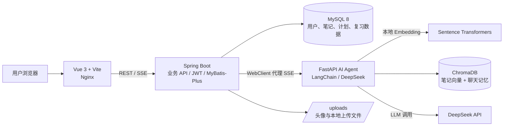
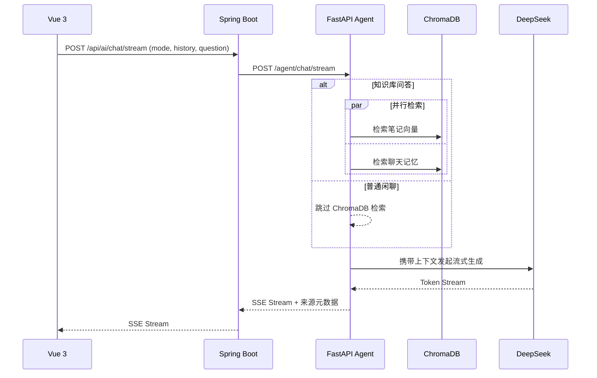

# Knowledge Atlas · AI 个人知识管理与学习助手

> 将“记录、理解、检索、复习、规划”串成学习闭环的个人知识管理系统。

[](./frontend)
[](./backend)
[](./ai-agent)
[](./docker-compose.yml)

## 项目简介

Knowledge Atlas 面向个人学习场景，解决传统笔记“记完难检索、学完易遗忘、知识难关联”的问题。系统支持 Markdown 笔记管理、资料导入解析、基于个人笔记的 RAG 问答、知识图谱提取、SM-2 间隔复习、AI 闪卡和学习计划，形成完整的个人知识学习闭环。

**项目亮点：**

- **三层解耦**：Vue 3 前端、Spring Boot 业务后端、FastAPI AI Agent 独立部署；Spring Boot 通过 WebClient 代理 AI 服务 SSE 流。
- **本地向量 RAG**：Sentence Transformers 本地生成嵌入，ChromaDB 持久化检索；笔记检索与聊天记忆检索并行执行，并返回可追溯的笔记来源。
- **学习闭环**：资料/笔记 → 向量化与知识图谱 → AI 问答/闪卡 → SM-2 复习提醒 → 学习计划与周报。

## 核心功能

| 模块 | 能力 |
| --- | --- |
| 知识笔记 | Markdown 编辑、分类标签、版本记录、回收站、导入导出 |
| 文档导入工作流 | 上传 PDF / DOCX / TXT / Markdown，AI 生成摘要、标签与笔记草稿，用户确认后入库 |
| AI 对话 | 知识库问答与普通闲聊两种模式；SSE 流式输出、笔记来源引用、聊天历史 |
| RAG 与语义检索 | 本地嵌入、ChromaDB 检索、长期对话记忆、笔记语义搜索 |
| 知识图谱 | 从笔记自动抽取概念和关系，并提供关联查询与人工维护 |
| 学习中心 | AI 闪卡、SM-2 间隔重复、待复习队列、学习计划、周报与成就 |
| 个人中心 | 学习数据概览、学习时长趋势、知识分类分布、头像上传 |

## 系统架构



### AI 问答链路



## 技术栈

| 层级 | 技术 |
| --- | --- |
| 前端 | Vue 3、TypeScript、Vite、Element Plus、ECharts、Vditor |
| 业务后端 | Java 17、Spring Boot 3、Spring Security、JWT、MyBatis-Plus、WebClient |
| AI 服务 | Python、FastAPI、LangChain、DeepSeek、Sentence Transformers、ChromaDB |
| 数据与部署 | MySQL 8、Docker Compose、Nginx |

## 重点代码导航

| 主题 | 关键实现 |
| --- | --- |
| RAG 流式问答、并行检索、耗时日志 | [rag_service.py](./ai-agent/app/services/rag_service.py) |
| ChromaDB 存储与本地嵌入 | [embedding_service.py](./ai-agent/app/services/embedding_service.py) · [vector_store.py](./ai-agent/app/services/vector_store.py) |
| 对话记忆双通道检索 | [chat_memory_service.py](./ai-agent/app/services/chat_memory_service.py) |
| PDF / DOCX / TXT / Markdown 解析 | [documents.py](./ai-agent/app/routers/documents.py) |
| 文档导入状态工作流 | [DocumentWorkflowServiceImpl.java](./backend/src/main/java/com/ka/service/impl/DocumentWorkflowServiceImpl.java) |
| SSE 代理转发 | [AiController.java](./backend/src/main/java/com/ka/controller/AiController.java) · [AiAgentClientImpl.java](./backend/src/main/java/com/ka/service/impl/AiAgentClientImpl.java) |
| SM-2 复习算法 | [review_service.py](./ai-agent/app/services/review_service.py) |
| AI 对话模式切换 | [AiAssistant/Index.vue](./frontend/src/views/AiAssistant/Index.vue) |

## 快速开始（Docker Compose）

### 1. 环境要求

- Docker Engine 24+ 与 Docker Compose v2
- 可用的 DeepSeek API Key
- 首次启动需要网络下载 Docker 镜像与本地嵌入模型

### 2. 配置环境变量

```bash
cp .env.example .env
```

编辑 `.env`，至少填写：

```dotenv
MYSQL_ROOT_PASSWORD=请设置强密码
JWT_SECRET=请设置长度不少于32位的随机字符串
DEEPSEEK_API_KEY=你的DeepSeek_API_Key
```

> `.env` 已被 Git 忽略，不要提交 API Key、数据库密码或 JWT 密钥。

### 3. 构建并启动

```bash
docker compose up -d --build
docker compose ps
```

默认通过 `http://localhost` 访问。若 80 端口被占用，在 `.env` 中设置：

```dotenv
PUBLIC_HTTP_PORT=8088
```

随后访问 `http://localhost:8088`。

### 4. 日志与停止服务

```bash
docker compose logs -f ai-agent
docker compose down
```

生产部署说明见：[deploy/README.md](./deploy/README.md)。

## 本地开发

```bash
# 前端
cd frontend && npm install && npm run dev

# Spring Boot 后端（需先准备 MySQL）
cd backend && mvn spring-boot:run

# AI Agent
cd ai-agent
python -m venv .venv
# Windows: .venv\Scripts\activate
# Linux/macOS: source .venv/bin/activate
pip install -r requirements.txt
uvicorn app.main:app --reload --port 8000
```

## 核心功能截图

发布前，请将实际运行截图放入 [`docs/screenshots`](./docs/screenshots/README.md)。README 已引用以下四张图片，文件补齐后 GitHub 会自动显示：

| 学习总览 | AI 知识库问答 |
| --- | --- |
|  |  |

| 文档导入工作流 | 知识图谱 |
| --- | --- |
|  |  |

## 目录结构

```text
.
├── frontend/                 # Vue 3 前端
├── backend/                  # Spring Boot 业务后端
├── ai-agent/                 # FastAPI + LangChain AI Agent
├── deploy/                   # 生产部署示例与说明
├── docs/                     # 架构、截图与补充文档
├── docker-compose.yml        # 一键部署编排
└── .env.example              # 环境变量模板
```

## 注意事项

- 扫描版 PDF 暂未接入 OCR，需要上传包含可提取文本的 PDF。
- 本地嵌入模型首次运行会下载并缓存到 Docker 持久化卷。
- 不要提交 `.env`、`uploads/`、`chroma_data/`、构建产物或 IDE 文件；根目录 `.gitignore` 已包含这些规则。

## License

本项目仅用于学习与毕业设计展示。若计划公开二次分发，请补充明确的开源许可证。
