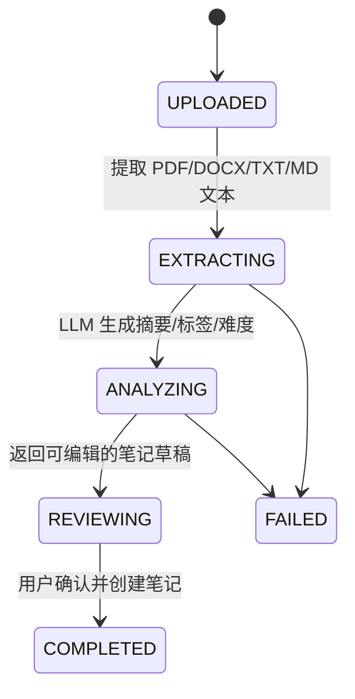

# 架构与核心实现说明

## 服务职责

| 服务 | 职责 | 对外暴露 |
| --- | --- | --- |
| `frontend` | 页面展示、SSE 消费、Markdown 编辑、学习数据可视化 | Nginx `80` |
| `backend` | 用户认证、业务数据、权限控制、文件访问、AI 请求代理 | Docker 内部 `8080` |
| `ai-agent` | RAG、向量化、知识图谱、文档解析、SM-2、学习计划生成 | Docker 内部 `8000` |
| `mysql` | 用户、笔记、标签、计划、复习、聊天记录等业务数据 | Docker 内部 `3306` |

## RAG 策略

知识库问答时，AI Agent 使用线程池并行执行两类检索：

1. 根据 `user_id` 检索当前用户的笔记向量。
2. 根据 `user_id` 检索历史对话记忆向量。

检索结果连同最近会话历史一起组装进 Prompt，再调用 DeepSeek 流式输出。结果结束时附带引用来源，前端可跳转回对应笔记。

普通闲聊模式使用相同的会话历史，但跳过 ChromaDB 检索，从而减少首 Token 前的等待。

相关实现：

- [`ai-agent/app/services/rag_service.py`](../ai-agent/app/services/rag_service.py)
- [`ai-agent/app/services/embedding_service.py`](../ai-agent/app/services/embedding_service.py)
- [`ai-agent/app/services/chat_memory_service.py`](../ai-agent/app/services/chat_memory_service.py)

## 文档导入工作流

工作流状态持久化在 MySQL 的 `document_workflows` 表中。解析完成后，用户可修改标题、正文、分类、标签和难度，再确认创建笔记；创建成功后异步同步向量，并创建复习提醒。

相关实现：

- [`ai-agent/app/routers/documents.py`](../ai-agent/app/routers/documents.py)
- [`backend/src/main/java/com/ka/service/impl/DocumentWorkflowServiceImpl.java`](../backend/src/main/java/com/ka/service/impl/DocumentWorkflowServiceImpl.java)
- [`frontend/src/views/Notes/Index.vue`](../frontend/src/views/Notes/Index.vue)

## SSE 流式转发

浏览器连接 Spring Boot 的 `/api/ai/chat/stream`。后端不暴露 FastAPI 服务地址，而是使用 `WebClient` 接收 Agent 的 SSE 数据并立即写回客户端。Nginx 配置关闭 API 代理缓冲，避免响应积压后一次性返回。

相关实现：

- [`backend/src/main/java/com/ka/controller/AiController.java`](../backend/src/main/java/com/ka/controller/AiController.java)
- [`backend/src/main/java/com/ka/service/impl/AiAgentClientImpl.java`](../backend/src/main/java/com/ka/service/impl/AiAgentClientImpl.java)
- [`frontend/nginx.conf`](../frontend/nginx.conf)
